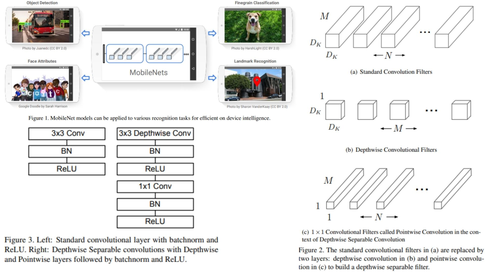

# 🏝️ MobileNet-Replication PyTorch Implementation

This repository contains a replication of **MobileNet** using PyTorch. The goal is to build a **lightweight CNN backbone** with **depthwise separable convolutions** for efficient inference on mobile and embedded devices.

- Implemented **MobileNet** using **Depthwise → Pointwise convolutions** for low-latency and compact model.  
- Architecture:  
**Conv → DepthwiseConv → PointwiseConv → ... → DepthwiseConv → PointwiseConv → GlobalAvgPool → Flatten → FC**  
**Paper**: [MobileNets: Efficient Convolutional Neural Networks for Mobile Vision Applications](https://arxiv.org/abs/1704.04861)

> 🎃 **Note:**  
> The **width multiplier (α)** is applied in this replication, but the **resolution multiplier (ρ)** is currently **not used**. It’s included in `config.py` for potential future use to reduce input/feature map resolution.

---

## 🖼 Overview – MobileNet with Depthwise Separable Convolutions

  

**Figure 1, Figure 2 & Figure 3:** Sketch of MobileNet stages. Each block contains a **depthwise convolution** followed by a **pointwise convolution**. Width multiplier (α) adjusts channel depth, and resolution multiplier (ρ) adjusts input and feature map resolution.  

> **Model overview:**  
> MobileNet is a small, fully convolutional network designed for **minimal parameters** and **low latency**. It splits standard convolutions into depthwise + pointwise layers, reducing computation significantly while keeping high accuracy for various vision tasks.

---

## 🏗 Project Structure

```bash
MobileNet-Replication/
│
├── src/
│   ├── layers/
│   │   ├── conv_layer.py           # Standard conv layer (3x3, 1x1)
│   │   ├── depthwise_conv.py       # Depthwise convolution
│   │   ├── pointwise_conv.py       # Pointwise 1x1 convolution
│   │   ├── pool_layers/
│   │   │   └── global_avgpool.py   # Global average pooling
│   │   └── flatten_layer.py        # Flatten output
│   │
│   ├── model/
│   │   └── mobilenet_model.py      # MobileNet assembly with blocks
│   │
│   └── config.py
├── images/
│   └── mobilenet_figures.jpg
│ 
├── requirements.txt
└── README.md
```
---

## 🔗 Feedback

For questions or feedback, contact: [barkin.adiguzel@gmail.com](mailto:barkin.adiguzel@gmail.com)
